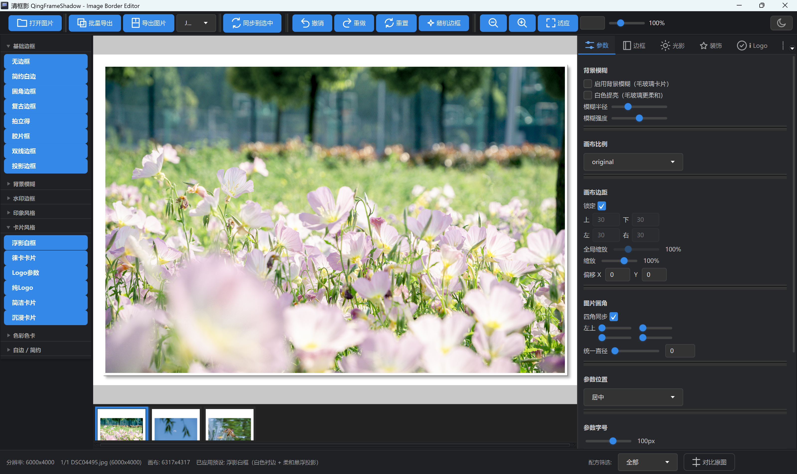
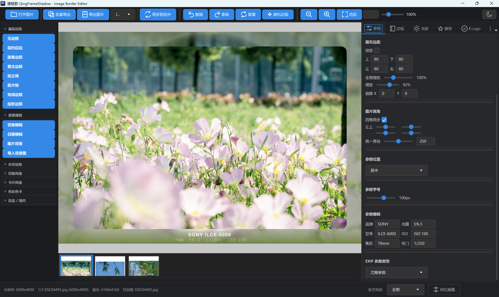

# 清框影 QingFrameShadow

一款基于 JavaFX 的桌面照片边框编辑工具：为照片一键添加白边、EXIF 参数水印、相机品牌 Logo、纹理与光影效果，支持批量导出高清原图。

> **双端架构**：本仓库同时包含桌面端（JavaFX 编辑器）与服务端（Spring Boot 模板云市场 API）。双端仅通过 HTTP + JSON 通信，服务端位于 `qingframe-server/` 子目录。

## 界面预览

| 主界面 | 边框效果 |
| --- | --- |
|  |  |

## ✨ 功能特性

- **边框样式丰富**：白边、阴影、辉光、渐变描边、胶片条、圆角卡片等 20+ 内置预设模板
- **EXIF 参数水印**：自动读取照片的光圈、快门、ISO、焦距、相机型号、拍摄日期
- **品牌 Logo 库**：内置 70+ 相机品牌 Logo（佳能、尼康、索尼、富士等），可叠加到任意边框
- **纹理材质**：11 种纹理（布纹、皮革、金属、水彩、木质等）
- **高清批量导出**：支持原画质 / 4K / 2K / 1080P 分辨率，批量导出异常自动降级重试
- **深浅主题**：内置深色 / 浅色两套界面主题
- **模板可扩展**：预设模板采用 JSON 驱动，新增模板无需改代码

## 🛠️ 技术栈

| 技术 | 用途 |
| --- | --- |
| Java 17 | 开发语言 |
| JavaFX 17 | 桌面 GUI 框架 |
| Maven | 工程构建与依赖管理 |
| metadata-extractor | EXIF 元数据解析 |
| Gson | JSON 解析（预设模板/相机库） |
| ControlsFX | 界面增强控件 |

## 🚀 快速开始

### 环境要求

- JDK 17 或更高版本
- Maven 3.8 或更高版本
- MySQL 8/9（仅模板市场功能需要，服务端使用）

### 运行

Windows（双击运行脚本）：

```bat
run.bat
```

或使用 PowerShell：

```powershell
.\run.ps1
```

Windows / Ubuntu 通用（Maven 方式）：

```bash
mvn javafx:run
```

### 双端一键启动（模板市场联调）

```powershell
# Windows：先启动 MySQL 服务，再执行（会提示输入 MySQL root 密码）
.\start-all.ps1
```

```bash
# Ubuntu：先启动 MySQL 服务，再执行
chmod +x start-all.sh
./start-all.sh
```

脚本会自动：启动/检测 MySQL → 后台拉起服务端（端口 8080）→ 等待健康检查通过 → 前台启动桌面端。
服务端详细说明（数据库初始化、接口速查、常见问题）见 [qingframe-server/README.md](qingframe-server/README.md)。

### 打包

```bash
mvn clean package
```

构建产物输出到 `target/` 目录。

## 📁 项目结构

仓库根目录：

```text
QingFrameShadow（仓库根目录）
├── src/                  # 桌面端源码（JavaFX 照片加框编辑器）
├── qingframe-server/     # 服务端源码（Spring Boot 模板云市场 API）
├── start-all.ps1         # Windows 双端一键启动
└── start-all.sh          # Ubuntu 双端一键启动
```

桌面端源码 `src/main/java/com/qingframe`：

```text
├── core/        # 核心渲染引擎：边框合成、EXIF 解析、Logo/水印/图标渲染
├── model/       # 数据模型：边框、光影、阴影辉光、文字贴纸、模板等配置
├── network/     # 模板市场客户端：API 调用、登录、市场窗口
├── service/     # 业务服务：预设加载、导出流程
├── ui/          # 界面：FXML 布局、Controller、主题样式
├── util/        # 工具类：文件、图片缓存、导出工具
└── Main.java    # 程序入口

桌面端资源 `src/main/resources/com/qingframe`：

```text
├── brandlogos/  # 70+ 相机品牌 Logo 资源
├── network/     # 登录 / 市场窗口 FXML
├── presets/     # 20+ 预设模板（JSON 驱动）
├── textures/    # 纹理材质
└── ui/          # 界面布局与主题 CSS
```

## 📝 更新日志

- **2026-08-16**：双端仓库整合——服务端作为 `qingframe-server/` 子目录纳入版本管理，新增一键启动脚本
- **2026-08-07**：图标与品牌 Logo 可叠加到任意相框样式；胶片框 EXIF 参数文字字号跟随参数调节
- **2026-08-06**：导出分辨率可选（原画质/4K/2K/1080P/安全）；修复批量导出 D3D 崩溃（异常降级重试、Prism 显存上限控制）；抽取 PresetService / ExportService 解耦控制器
- **2026-08-06**：首个可用完整版本（含预览、导出、预设、批处理）

## ❓ 常见问题

**批量导出时程序崩溃或黑屏？**
通常为显卡显存不足，程序已内置降级重试机制；也可在导出设置中降低分辨率后再试。

**导出图片与预览不一致？**
请确认系统字体与预览环境一致，部分自定义字体在导出时使用系统字体渲染。

## 📄 许可

本项目仅供学习交流使用，请勿用于商业用途。
